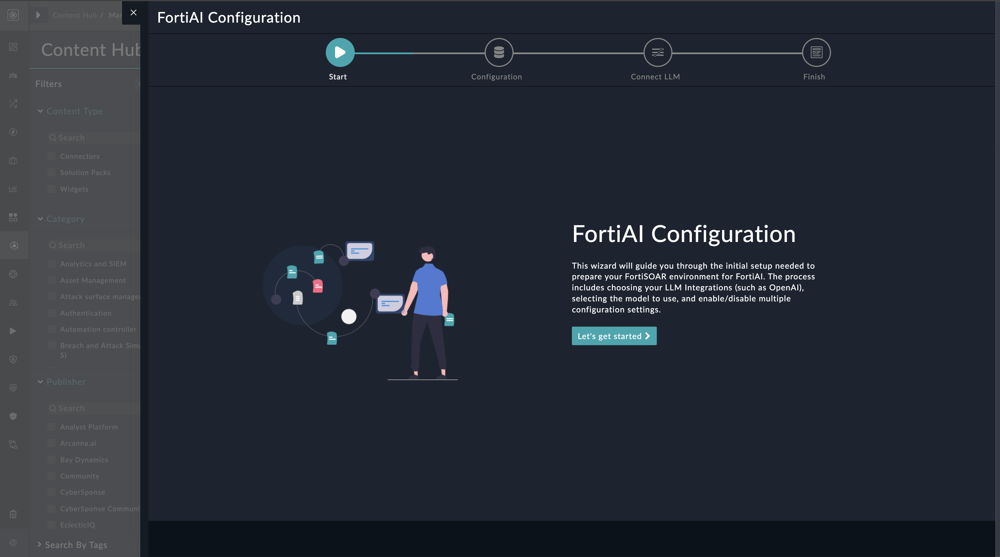
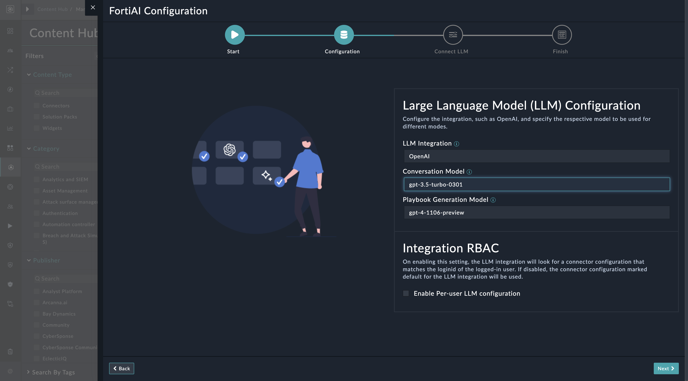
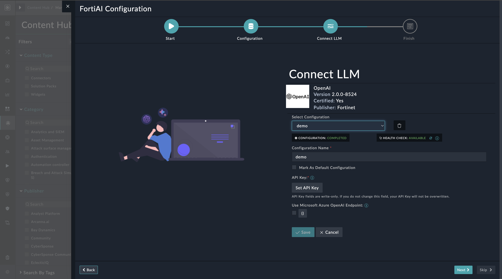
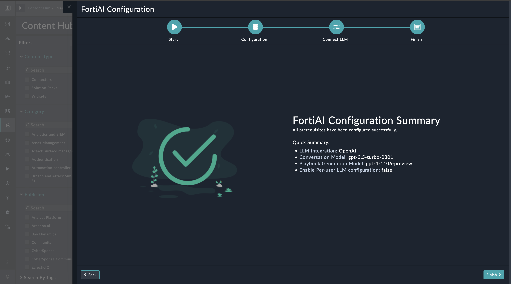

| [Home](../README.md) |
|--------------------------------------------|

# Installation

1. To install a widget, click **Content Hub** > **Discover**.

2. From the list of solution pack that appears, search for and select **FortiAI**. 

3. Click the card of the **FortiAI** solution pack card.

4. Click **Configure** on the bottom to begin configuration.

# Configuration

## FortiAI Configuration Wizard Widget Settings

The configuration settings of the FortiAI Configuration widget include the following steps to setup FortiAI configuration:

- Click the **Configure** button to bring up the following wizard screen

    

- Click **Let's Get Started** to proceed

- On **Configuration** page, select the following fields
  - LLM Integration &mdash; **OpenAI**.
  - Conversation Model &mdash; **gpt-3.5-turbo, gpt-3.5-turbo-0301, gpt-4, gpt-4-1106-preview**.
  - Playbook Generation Model &mdash; **gpt-3.5-turbo, gpt-3.5-turbo-0301, gpt-4, gpt-4-1106-preview**.
  - Enable Per-user LLM configuration.

- Click **Next** on lower-right corner

    

- On the **Connect LLM** page, configure your LLM Integration.

- Click **Next** on lower-right corner

    

- Click **Finish** to complete the configuration.

    

Navigate to the **FortiAI** in the navigation menu to start using the solution pack